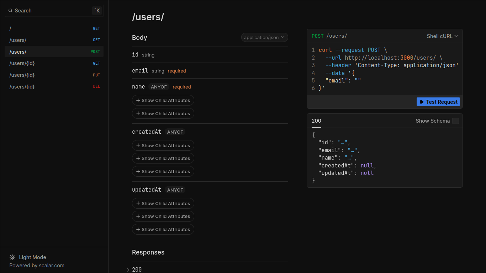

# ElysiaJS Boilerplate Project

A simple ElysiaJS project with Swagger, CORS, and Prisma integrated.

## Features

- **ElysiaJS**: A lightweight and fast web framework.
- **Swagger**: API documentation available at `/swagger`.
- **CORS**: Cross-Origin Resource Sharing enabled.
- **Prisma**: Database ORM for easy data management.

## Database

- **Default DB**: PostgreSQL
- **ORM**: Prisma is used to interact with the database.
- **Schema**: Located at `prisma/schema.prisma`

### Prisma Commands

To initialize and manage Prisma, use the following commands:

```bash
# Initialize Prisma (already done)
bun prisma init

# Generate Prisma client
bun prisma generate

# Run database migrations
bun prisma migrate
```

## Swagger Documentation

Access the Swagger documentation at `/swagger`.



## Getting Started

To create a new project using this boilerplate, run:

```bash
bun create 
```

## License

This project is licensed under the MIT License.

